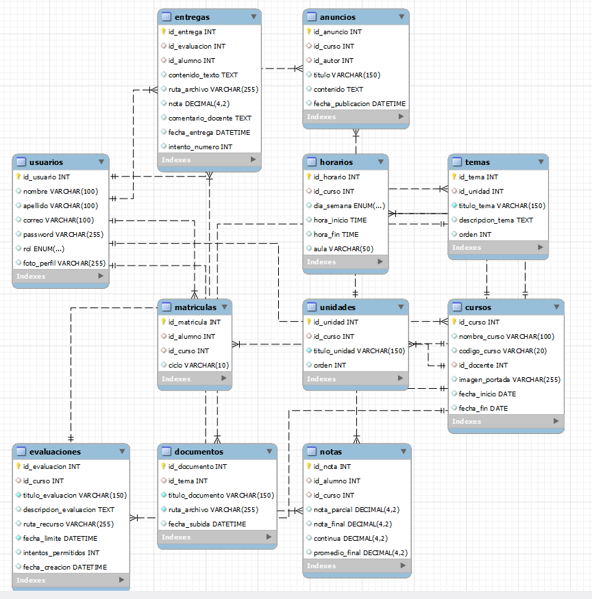

# PortalAcademico
Sistema Integral de Gestión Académica diseñado para la administración de cursos, calificaciones y entrega de evaluaciones. Facilita la interacción entre docentes y estudiantes en un entorno seguro y centralizado.
## 📊 Modelo de Base de Datos
