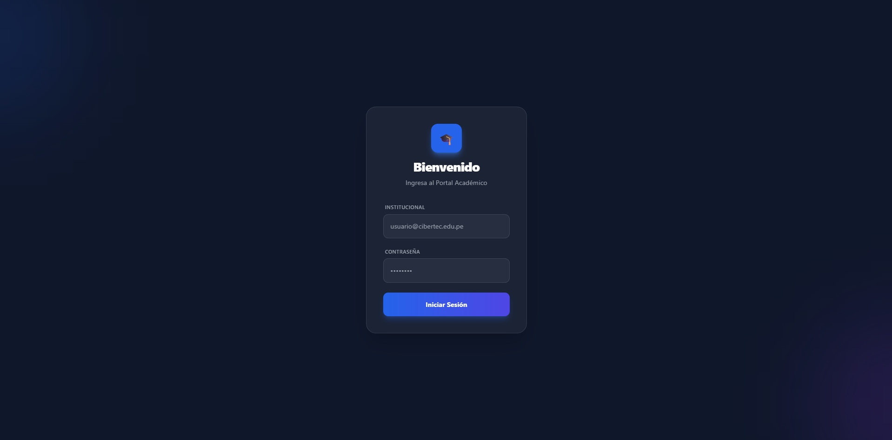
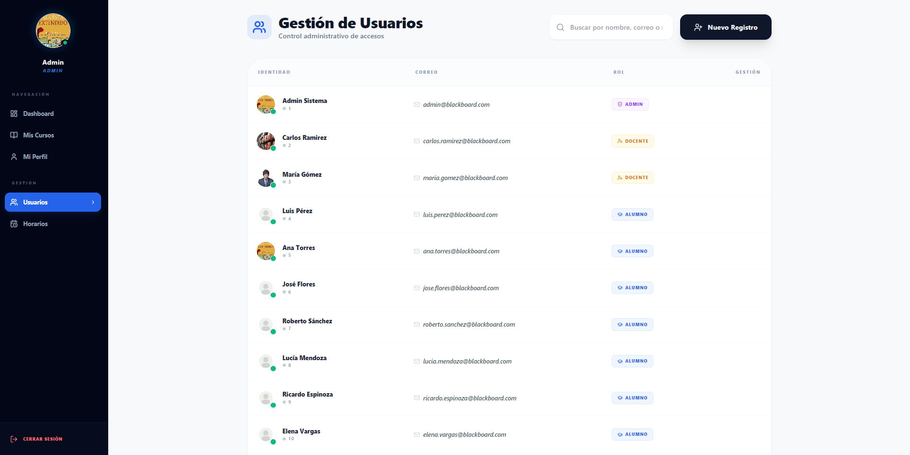
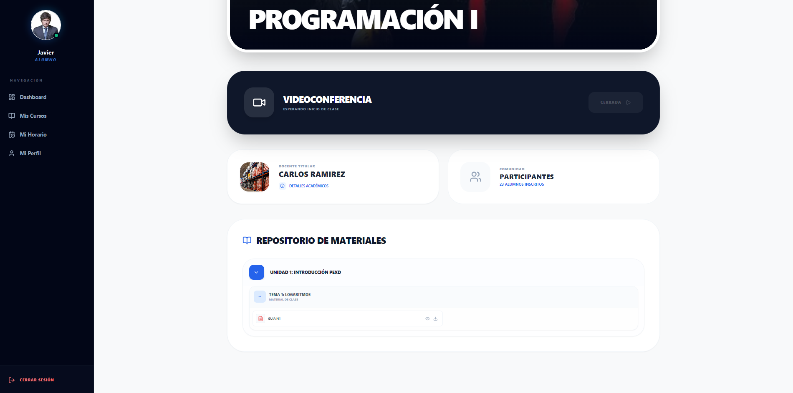
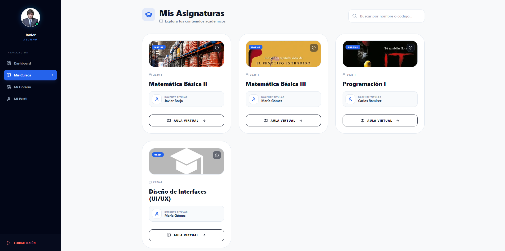
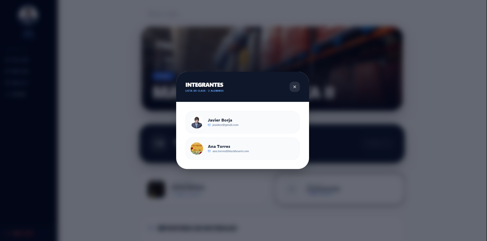
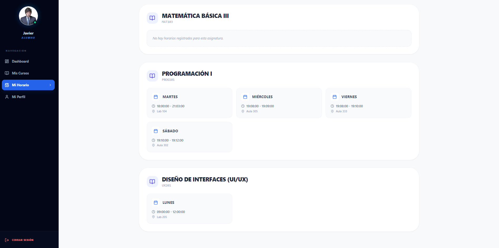
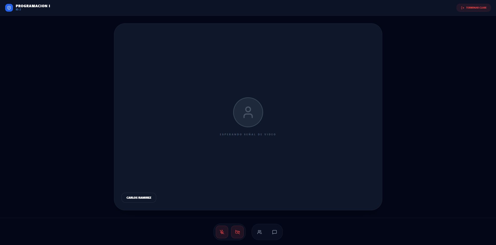
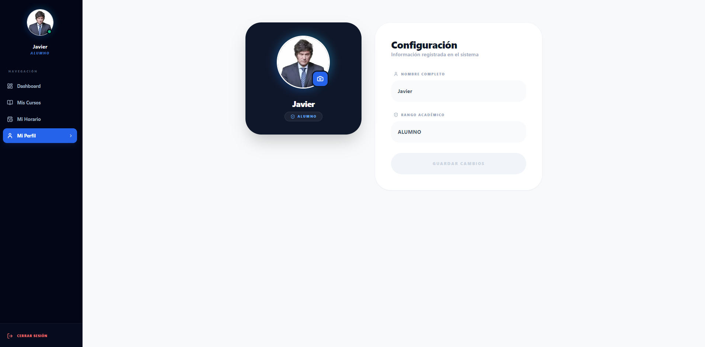

# 🎓 PortalAcademico - Sistema Integral de Gestión Académica

<div align="center">


[](https://spring.io/projects/spring-boot)
[](https://reactjs.org/)
[](https://www.mysql.com/)
[](https://tailwindcss.com/)
[](https://developer.mozilla.org/en-US/docs/Web/API/WebSocket)

**Sistema completo de gestión académica con roles diferenciados, comunicación en tiempo real y herramientas de enseñanza virtual.**

[🚀 Características](#-características-principales) • [📦 Instalación](#-instalación-y-configuración) • [📖 Documentación](#-documentación) • [🤝 Contribuir](#-contribuir)

</div>

---

## 📋 Descripción

**PortalAcademico** es una plataforma integral de gestión educativa tipo Blackboard que permite la administración completa de cursos, estudiantes y docentes. El sistema cuenta con tres roles diferenciados (Administrador, Docente y Alumno), cada uno con interfaces y funcionalidades específicas para optimizar el proceso educativo.

> ⚠️ **Nota:** Este proyecto se encuentra actualmente en desarrollo activo. Algunas funcionalidades pueden estar en fase de implementación.

---

## ✨ Características Principales

### 🔐 Sistema de Autenticación por Roles

- **Login Diferenciado**: Cada rol tiene su propia interfaz de inicio de sesión
- **Vistas Personalizadas**: Dashboards específicos según el rol del usuario
- **Gestión de Perfiles**: Todos los usuarios pueden editar su información personal y foto de perfil
- **Seguridad JWT**: Autenticación basada en tokens para protección de endpoints

### 👨‍🎓 Funcionalidades para Alumnos

- ✅ **Visualización de Cursos**: Acceso a todos los cursos matriculados
- 📅 **Horarios Personalizados**: Consulta de horarios académicos
- 📚 **Unidades de Trabajo**: Acceso a materiales organizados por unidades y temas
- 📄 **Documentos de Estudio**: Descarga de materiales de clase
- 💬 **Sesiones en Vivo**: Participación en clases virtuales con interacción en tiempo real
- 📢 **Anuncios**: Recepción de notificaciones programadas por docentes
- 📝 **Evaluaciones**: Realización de pruebas y exámenes (en desarrollo)

### 👨‍🏫 Funcionalidades para Docentes

- 📝 **Gestión de Cursos**: Administración completa de sus cursos asignados
- 📢 **Programación de Anuncios**: Creación y envío de notificaciones a estudiantes
- 📚 **Unidades de Trabajo**: 
  - Creación de unidades temáticas
  - Adición de temas específicos
  - Carga de documentos y materiales de estudio
- 📊 **Evaluaciones**: Sistema de creación de exámenes (en desarrollo)
- 🎥 **Sesiones en Vivo**:
  - Apertura de salas de clase virtuales por curso
  - Chat en tiempo real con estudiantes (implementado)
  - Streaming de video/audio (en desarrollo)
  - Interacción bidireccional con alumnos

### 👨‍💼 Funcionalidades para Administradores

- 🏫 **Gestión de Cursos**:
  - Creación, modificación y eliminación de cursos
  - Asignación de docentes a cursos
  - Reasignación flexible de profesores
- 👥 **Gestión de Usuarios**:
  - Creación de usuarios con roles específicos
  - Matriculación de alumnos en cursos
  - Eliminación de estudiantes de cursos
  - Administración completa de perfiles
- 📅 **Gestión de Horarios**:
  - Creación de horarios académicos
  - Modificación y eliminación de horarios
  - Asignación de horarios a cursos y estudiantes
- 🔧 **Configuración del Sistema**: Control total sobre parámetros del sistema

---

## 🛠️ Tecnologías Utilizadas

### Backend
| Tecnología | Versión | Uso |
|------------|---------|-----|
| ☕ Java | 17+ | Lenguaje principal |
| 🍃 Spring Boot | 3.x | Framework backend |
| 🔐 Spring Security | 3.x | Autenticación y autorización |
| 🔑 JWT | - | Tokens de seguridad |
| 🗄️ MySQL | 8.x | Base de datos relacional |
| 🔌 WebSocket | - | Comunicación en tiempo real |
| 📦 Maven | - | Gestión de dependencias |

### Frontend
| Tecnología | Versión | Uso |
|------------|---------|-----|
| ⚛️ React | 18.x | Librería UI |
| 🎨 Tailwind CSS | 3.x | Framework CSS |
| ⚡ Vite | - | Build tool |
| 🔗 Axios | - | Cliente HTTP |
| 🧭 Lucide React | - | Iconografía |
| 💬 Socket.io Client | - | WebSocket cliente |

---

## 🚀 Instalación y Configuración

### Prerrequisitos

Asegúrate de tener instalado:

- **Java JDK 17+**
- **Node.js 16+** y **npm**
- **MySQL 8.x**
- **Git**

### 1️⃣ Clonar el Repositorio

```bash
git clone https://github.com/tu-usuario/PortalAcademico.git
cd PortalAcademico
```

### 2️⃣ Configurar Base de Datos

Ejecuta el script SQL para crear la base de datos y las tablas:

```bash
cd database
mysql -u root -p < script.sql
```

La base de datos `blackboard_db` será creada automáticamente con todas las tablas necesarias.

### 3️⃣ Configurar Backend

#### Actualizar credenciales de BD

Edita el archivo `backend/src/main/resources/application.properties`:
De acuerdo atus requerimientos

#### Iniciar el servidor

```bash
cd backend
./mvnw clean install
./mvnw spring-boot:run
```

El backend estará disponible en `http://localhost:8080`

### 4️⃣ Configurar Frontend

#### Instalar dependencias

```bash
cd frontend
npm install
```

#### Iniciar aplicación

```bash
npm run dev
```

El frontend estará disponible en `http://localhost:5173`

---
# 📸 Capturas de Pantalla del Sistema

Documentación visual completa del sistema educativo virtual.

---

## 🔐 Autenticación

### Inicio de Sesión

*Página de inicio de sesión con autenticación segura para usuarios del sistema*

---

## 👨‍💼 Vista de Administrador

### Panel de Control Administrativo
### Gestión de Usuarios

*Administración completa de usuarios del sistema (estudiantes, docentes y administradores)*

### Gestión de Horarios

*Panel de gestión y configuración de horarios académicos*

---

## 👨‍🏫 Vista de Docente

### Materiales de Trabajo

*Gestión de materiales educativos y recursos de aprendizaje*

### Previsualización de Materiales

*Vista previa de materiales antes de publicarlos a los estudiantes*

---

## 👨‍🎓 Vista de Estudiante

### Aula Virtual

*Acceso al aula virtual con recursos y actividades*

### Catálogo de Cursos

*Lista completa de cursos disponibles para el estudiante*

### Detalle del Curso

*Información detallada del curso: descripción, objetivos, contenido y evaluaciones*

### Integrantes del Curso

*Lista de compañeros y docentes participantes en el curso*

### Horarios

*Visualización del horario de clases y calendario académico*

---

## 🎥 Sesiones en Vivo

### Clase Virtual en Tiempo Real

*Clase virtual con chat en tiempo real, video conferencia y pizarra interactiva*

---

## 👤 Perfil de Usuario

### Mi Perfil

*Perfil personal del usuario con información académica y configuración de cuenta*

---
## 🔄 Flujo de Trabajo

### Para Administradores
1. Login con credenciales de admin
2. Crear cursos y asignar docentes
3. Crear usuarios (alumnos/docentes)
4. Matricular alumnos en cursos
5. Configurar horarios
6. Monitorear el sistema

### Para Docentes
1. Login con credenciales de docente
2. Acceder a cursos asignados
3. Crear unidades de trabajo y temas
4. Subir materiales de estudio
5. Programar anuncios
6. Iniciar sesiones en vivo
7. Crear evaluaciones (próximamente)

### Para Alumnos
1. Login con credenciales de alumno
2. Ver cursos matriculados
3. Consultar horarios
4. Descargar materiales
5. Participar en sesiones en vivo
6. Realizar evaluaciones
7. Recibir anuncios

---

## 🚧 En Desarrollo

Las siguientes funcionalidades están actualmente en desarrollo:

- [ ] 🎥 **Streaming de Video/Audio** en sesiones en vivo (WebRTC)
- [ ] 📝 **Sistema Completo de Evaluaciones** con calificación automática
- [ ] 📊 **Dashboard de Estadísticas** para docentes y administradores
- [ ] 📧 **Notificaciones por Email** para eventos importantes
- [ ] 🔔 **Sistema de Notificaciones Push** en tiempo real
- [ ] 📈 **Reportes y Analytics** avanzados
- [ ] 💾 **Backup Automático** de base de datos

---
## 🤝 Contribuir

¡Las contribuciones son bienvenidas! Por favor sigue estos pasos:

### Convenciones de Código

- **Java**: Seguir las convenciones de Google Java Style Guide
- **JavaScript/React**: ESLint con configuración Airbnb
- **Commits**: Usar Conventional Commits (feat, fix, docs, etc.)

---

## 🐛 Reportar Problemas

Si encuentras un bug o tienes una sugerencia:

1. Verifica que no exista un issue similar
2. Crea un nuevo issue con una descripción detallada
3. Incluye capturas de pantalla si es posible
4. Especifica tu entorno (OS, versiones, navegador)

---

## 👥 Equipo

Desarrollado con ❤️ por Javier Borja Samaniego

---

## 🙏 Agradecimientos

- Spring Boot Team por el excelente framework
- React Team por la increíble librería
- Tailwind CSS por el sistema de diseño
- Todos los contribuidores del proyecto

---

## 📞 Contacto


[](https://github.com/JavierBorja09)
[](https://www.linkedin.com/in/javier-jeanpool-borja-samaniego-a6b8b7300/)

---

<div align="center">

**⭐ Si te gusta este proyecto, no olvides darle una estrella ⭐**

**Hecho con 💙 para mejorar la educación**

</div>